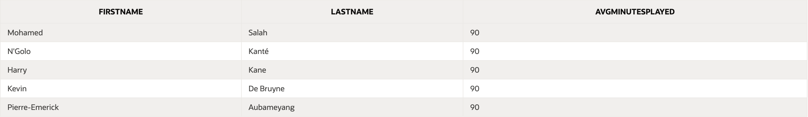

drop table Teams cascade constraints;
drop table Players cascade constraints;
drop table Matchs cascade constraints;
drop table PlayerStats cascade constraints;

-- 1. Create Teams table

CREATE TABLE Teams (
    TeamID NUMBER GENERATED BY DEFAULT ON NULL AS IDENTITY PRIMARY KEY,
    TeamName VARCHAR2(255 CHAR) NOT NULL,
    FoundedYear NUMBER,
    HomeStadium VARCHAR2(255 CHAR)
);

-- 2. Create Players table

CREATE TABLE Players (
    PlayerID NUMBER GENERATED BY DEFAULT ON NULL AS IDENTITY PRIMARY KEY,
    FirstName VARCHAR2(50 CHAR) NOT NULL,
    LastName VARCHAR2(50 CHAR) NOT NULL,
    DateOfBirth DATE,
    Position VARCHAR2(50 CHAR),
    TeamID NUMBER,
    CONSTRAINT fk_players_teams FOREIGN KEY (TeamID) REFERENCES Teams(TeamID)
);

-- 3. Create Matches table

CREATE TABLE Matchs (
    MatchID NUMBER GENERATED BY DEFAULT ON NULL AS IDENTITY PRIMARY KEY,
    MatchDate DATE,
    HomeTeamID NUMBER,
    AwayTeamID NUMBER,
    HomeTeamScore NUMBER,
    AwayTeamScore NUMBER,
    Season VARCHAR2(10 CHAR)
);

-- 4. Create PlayerStats table

CREATE TABLE PlayerStats (
    StatID NUMBER GENERATED BY DEFAULT ON NULL AS IDENTITY PRIMARY KEY,
    PlayerID NUMBER,
    MatchID NUMBER,
    GoalsScored NUMBER,
    Assists NUMBER,
    YellowCards NUMBER,
    RedCards NUMBER,
    MinutesPlayed NUMBER,
    CONSTRAINT fk_playerstats_players FOREIGN KEY (PlayerID) REFERENCES Players(PlayerID),
    CONSTRAINT fk_playerstats_matches FOREIGN KEY (MatchID) REFERENCES Matches(MatchID)
);

-- 5. Populate Teams table

INSERT INTO Teams (TeamName, FoundedYear, HomeStadium) VALUES
    ('Manchester United', 1878, 'Old Trafford');
INSERT INTO Teams (TeamName, FoundedYear, HomeStadium) VALUES
    ('Liverpool FC', 1892, 'Anfield');
INSERT INTO Teams (TeamName, FoundedYear, HomeStadium) VALUES
    ('Chelsea FC', 1905, 'Stamford Bridge');
INSERT INTO Teams (TeamName, FoundedYear, HomeStadium) VALUES
    ('Manchester City', 1880, 'Etihad Stadium');
INSERT INTO Teams (TeamName, FoundedYear, HomeStadium) VALUES
    ('Arsenal FC', 1886, 'Emirates Stadium');

-- 6. Populate Players table

INSERT INTO Players (FirstName, LastName, DateOfBirth, Position, TeamID) VALUES
    ('Harry', 'Kane', TO_DATE('1993-07-28', 'YYYY-MM-DD'), 'Forward', 1);
INSERT INTO Players (FirstName, LastName, DateOfBirth, Position, TeamID) VALUES
    ('Mohamed', 'Salah', TO_DATE('1992-06-15', 'YYYY-MM-DD'), 'Forward', 2);
INSERT INTO Players (FirstName, LastName, DateOfBirth, Position, TeamID) VALUES
    ('N''Golo', 'Kanté', TO_DATE('1991-03-29', 'YYYY-MM-DD'), 'Midfielder', 3);
INSERT INTO Players (FirstName, LastName, DateOfBirth, Position, TeamID) VALUES
    ('Kevin', 'De Bruyne', TO_DATE('1991-06-28', 'YYYY-MM-DD'), 'Midfielder', 4);
INSERT INTO Players (FirstName, LastName, DateOfBirth, Position, TeamID) VALUES
    ('Pierre-Emerick', 'Aubameyang', TO_DATE('1989-06-18', 'YYYY-MM-DD'), 'Forward', 5);

-- 7. Populate Matches table

INSERT INTO Matchs (MatchDate, HomeTeamID, AwayTeamID, HomeTeamScore, AwayTeamScore, Season) VALUES
    (TO_DATE('2023-08-12', 'YYYY-MM-DD'), 1, 2, 2, 1, '2023/2024');
INSERT INTO Matchs (MatchDate, HomeTeamID, AwayTeamID, HomeTeamScore, AwayTeamScore, Season) VALUES
    (TO_DATE('2023-08-13', 'YYYY-MM-DD'), 3, 4, 0, 2, '2023/2024');
INSERT INTO Matchs (MatchDate, HomeTeamID, AwayTeamID, HomeTeamScore, AwayTeamScore, Season) VALUES
    (TO_DATE('2023-08-14', 'YYYY-MM-DD'), 5, 1, 1, 1, '2023/2024');
INSERT INTO Matchs (MatchDate, HomeTeamID, AwayTeamID, HomeTeamScore, AwayTeamScore, Season) VALUES
    (TO_DATE('2023-08-15', 'YYYY-MM-DD'), 2, 3, 3, 0, '2023/2024');
INSERT INTO Matchs (MatchDate, HomeTeamID, AwayTeamID, HomeTeamScore, AwayTeamScore, Season) VALUES
    (TO_DATE('2023-08-16', 'YYYY-MM-DD'), 4, 5, 1, 1, '2023/2024');

-- 8. Populate PlayerStats table

INSERT INTO PlayerStats (PlayerID, MatchID, GoalsScored, Assists, YellowCards, RedCards, MinutesPlayed) VALUES
    (1, 1, 1, 0, 0, 0, 90);
INSERT INTO PlayerStats (PlayerID, MatchID, GoalsScored, Assists, YellowCards, RedCards, MinutesPlayed) VALUES
    (2, 1, 1, 1, 0, 0, 90);
INSERT INTO PlayerStats (PlayerID, MatchID, GoalsScored, Assists, YellowCards, RedCards, MinutesPlayed) VALUES
    (3, 2, 0, 1, 1, 0, 90);
INSERT INTO PlayerStats (PlayerID, MatchID, GoalsScored, Assists, YellowCards, RedCards, MinutesPlayed) VALUES
    (4, 2, 0, 2, 0, 0, 90);
INSERT INTO PlayerStats (PlayerID, MatchID, GoalsScored, Assists, YellowCards, RedCards, MinutesPlayed) VALUES
    (5, 3, 1, 0, 0, 0, 90);

-- 9. Find the top goal-scorer:

SELECT Players.FirstName, Players.LastName, SUM(PlayerStats.GoalsScored) AS TotalGoals
FROM Players
JOIN PlayerStats ON Players.PlayerID = PlayerStats.PlayerID
GROUP BY Players.FirstName, Players.LastName
ORDER BY TotalGoals DESC
FETCH FIRST 1 ROWS ONLY;

-- 10. Identify players with the most assists:

SELECT Players.FirstName, Players.LastName, SUM(PlayerStats.Assists) AS TotalAssists
FROM Players
JOIN PlayerStats ON Players.PlayerID = PlayerStats.PlayerID
GROUP BY Players.FirstName, Players.LastName
ORDER BY TotalAssists DESC
FETCH FIRST 5 ROWS ONLY;

--11. List teams that scored the most goals:

SELECT Teams.TeamName, SUM(Matches.HomeTeamScore) AS HomeGoals, SUM(Matches.AwayTeamScore) AS AwayGoals
FROM Teams
LEFT JOIN Matches ON Teams.TeamID = Matches.HomeTeamID OR Teams.TeamID = Matches.AwayTeamID
GROUP BY Teams.TeamName
ORDER BY (HomeGoals + AwayGoals) DESC
FETCH FIRST 5 ROWS ONLY;

-- 12. Find players with the highest average minutes played per match:

SELECT Players.FirstName, Players.LastName, AVG(PlayerStats.MinutesPlayed) AS AvgMinutesPlayed
FROM Players
JOIN PlayerStats ON Players.PlayerID = PlayerStats.PlayerID
GROUP BY Players.FirstName, Players.LastName
ORDER BY AvgMinutesPlayed DESC
FETCH FIRST 5 ROWS ONLY;

-- 13. Calculate the total number of red cards and yellow cards issued per team:

SELECT Teams.TeamName, SUM(PlayerStats.RedCards) AS TotalRedCards, SUM(PlayerStats.YellowCards) AS TotalYellowCards
FROM Teams
LEFT JOIN Players ON Teams.TeamID = Players.TeamID
LEFT JOIN PlayerStats ON Players.PlayerID = PlayerStats.PlayerID
GROUP BY Teams.TeamName
ORDER BY Teams.TeamName;

-- 14. Teams with the most red cards 
SELECT Teams.TeamName, SUM(PlayerStats.RedCards) AS TotalRedCards
FROM Teams
JOIN Players ON Teams.TeamID = Players.TeamID
JOIN PlayerStats ON Players.PlayerID = PlayerStats.PlayerID
GROUP BY Teams.TeamName
ORDER BY TotalRedCards DESC
FETCH FIRST 1 ROWS ONLY;

-- 15. Player who has the best goal-to-minutes-played ratio:

SELECT
    Players.FirstName,
    Players.LastName,
    SUM(PlayerStats.GoalsScored) AS TotalGoals,
    SUM(PlayerStats.MinutesPlayed) AS TotalMinutesPlayed,
    SUM(PlayerStats.GoalsScored) / SUM(PlayerStats.MinutesPlayed) AS GoalsPerMinute
FROM
    Players
JOIN
    PlayerStats ON Players.PlayerID = PlayerStats.PlayerID
GROUP BY
    Players.PlayerID,
    Players.FirstName,   
    Players.LastName     
HAVING
    SUM(PlayerStats.MinutesPlayed) > 0
ORDER BY
    GoalsPerMinute DESC
FETCH FIRST 1 ROWS ONLY;

-- 16. Find the players with the highest total contributions (goals + assists) in all seasons:

SELECT Players.FirstName, Players.LastName, 
       SUM(PlayerStats.GoalsScored + PlayerStats.Assists) AS TotalContributions
FROM Players
JOIN PlayerStats ON Players.PlayerID = PlayerStats.PlayerID
GROUP BY Players.PlayerID, Players.FirstName, Players.LastName
ORDER BY TotalContributions DESC;

-- 17. Calculate the average number of goals scored in home matches:

SELECT AVG(HomeTeamScore) AS AvgGoalsScoredAtHome
FROM Matches;

-- 18. Find the teams that have won the most matches at home:

SELECT Teams.TeamName, COUNT(Matches.MatchID) AS HomeWins
FROM Teams
JOIN Matches ON Teams.TeamID = Matches.HomeTeamID
WHERE Matches.HomeTeamScore > Matches.AwayTeamScore
GROUP BY Teams.TeamName
ORDER BY HomeWins DESC;

 
 -- 19. Matches with Both Teams Scoring:

SELECT MatchDate, HomeTeamID, AwayTeamID, HomeTeamScore, AwayTeamScore
FROM Matches
WHERE HomeTeamScore >= 1 AND AwayTeamScore >= 1;

-- 20. Oldest team:

SELECT TeamName AS OldestTeamName, FoundedYear AS OldestTeamFoundedYear
FROM Teams
WHERE FoundedYear = (SELECT MIN(FoundedYear) FROM Teams); 

